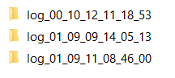
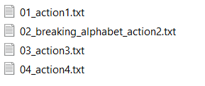
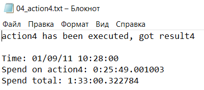

pool_map
========
`pool_map(func, iterable, n_threads=1)`

Аналог [multiprocessing.Pool(n_threads).map(func, iterable)](https://docs.python.org/3/library/multiprocessing.html) с открытием и закрытием пула и использованием простого цикла, если `n_threads == 1`

##### Параметры:
* __func__: callable - вызываемая функция
* __iterable__: iterable - список или генератор входных параметров функции
* __n_threads__: int, _default=1_ - количество потоков

##### Возвращает:
* __result__: list - список возвращенных функцией значений

##### Примеры:
```python
>>> def square(a):
...     return a ** 2
>>> if __name__ == '__main__':
...     pool_map(square, range(5), 2) # считается в двух потоках
[0, 1, 4, 9, 16]
>>> pool_map(square, range(5), 1) # считается в одном потоке
[0, 1, 4, 9, 16]
```

gini_score
==========
`gini_score(y_true, y_score, average='macro', sample_weight=None)`

Вычисляет коэффициент Джини. Совместима с экосистемой sklearn.

Вычисляется на основе [sklearn.metrics.roc_auc_score](https://scikit-learn.org/stable/modules/generated/sklearn.metrics.roc_auc_score.html)

##### Параметры:
* __y_true__: array-like of shape (n_samples,) or (n_samples, n_classes) - верные метки классов
* __y_score__: array-like of shape (n_samples,) or (n_samples, n_classes) - предсказанные метки классов
* __average__: {‘micro’, ‘macro’, ‘samples’, ‘weighted’} or None, *default=’macro’* - для бинарной классификации не имеет значения, для многоклассовой классификации определяет тип усреднения (подробнее в документации sklearn)
* __sample_weight__: array-like of shape (n_samples,), *default=None* - веса измерений

##### Возвращает:
* __gini__: float - коэффициент Джини

##### Примеры:
```python
>>> gini_score([0, 0, 1, 1], [0.11, 0.09, 0.11, 0.13])
0.75
```
```python
>>> gini_score([0, 0, 1, 1], [0.11, 0.09, 0.11, 0.13], None, [1, 2, 3, 4])
0.8571428571428572
```

gini_avg_score
==============
`gini_avg_score(y_true, y_score, average='macro', sample_weight=None, y_group=None)`

Вычисляет средний коэффициент Джини по группам.

Вычисляется на основе gini_score.

##### Параметры:
* __y_true__: array-like of shape (n_samples,) or (n_samples, n_classes) - верные метки классов
* __y_score__: array-like of shape (n_samples,) or (n_samples, n_classes) - предсказанные метки классов
* __average__: {‘micro’, ‘macro’, ‘samples’, ‘weighted’} or None, *default=’macro’* - для бинарной классификации не имеет значения, для многоклассовой классификации определяет тип усреднения (подробнее в документации sklearn)
* __sample_weight__: array-like of shape (n_samples,), *default=None* - веса измерений
* __y_group__: array-like of shape (n_samples,), *default=None* - метки групп

##### Возвращает:
* __gini_avg__: float - средний коэффициент Джини по группам

##### Заметки:
* При пустом параметре y_group вычисляет обычный коэффициент Джини
* При заполненном параметре y_group и пустом параметре sample_weight вычисляет средний коэффициент Джини по группам с равным весом групп
* При заполненном параметре y_group и заполненном параметре sample_weight вычисляет средний коэффициент Джини по группам с весом групп, равным сумме весов в группе
* Если при заполненном параметре y_group задать все веса равными 1, то вес группы будет равен количеству элементов в ней

##### Примеры:
```python
>>> gini_avg_score(y_true=[0, 0, 0, 0, 1, 1, 1, 1],
...                y_score=[0.05, 0.1, 0.06, 0.07, 0.08, 0.09, 0.11, 0.12])
0.75
```
```python
>>> gini_avg_score(y_true=[0, 0, 0, 0, 1, 1, 1, 1],
...                y_score=[0.05, 0.1, 0.06, 0.07, 0.08, 0.09, 0.11, 0.12],
...                y_group=[1, 2, 1, 3, 1, 2, 3, 2])
0.6666666666666666
```
```python
>>> gini_avg_score(y_true=[0, 0, 0, 0, 1, 1, 1, 1],
...                y_score=[0.05, 0.1, 0.06, 0.07, 0.08, 0.09, 0.11, 0.12],
...                sample_weight=[2, 2, 1, 1, 1, 1, 1, 1],
...                y_group=[1, 2, 1, 3, 1, 2, 3, 2])
0.6
```

Log
===
`class Log(digits=3, exception_to_log=True)`

Класс для логирования процесса разработки. Записывает весь текст, возвращаемый функцией в нумерованный лог-файл в директории logs/log_(дата_время), также сохраняя информацию о затраченном на выполнение времени.

##### Параметры:
* __digits__: int, *default=3* - количество цифр в нумерации лог-файлов
* __exception_to_log__: bool, *default=True* - записывать ли ошибки в лог-файл
    * _True_ - выполнение продолжается несмотря на ошибку, текст ошибки записывается в лог-файл
    * _False_ - выполнение прерывается, лог-файл остается пустым, текст ошибки выводится в консоль

##### Примеры:
```python
>>> def action1():
...     return 1
>>> def action2():
...     return 2
>>> log = Log(digits=2)
>>> @log.log_decorator('action1')
>>> def exec_action1():
...     global result1
...     result1 = action1()
...     log_text = 'action1 has been executed, got result1'
...     return log_text
>>> @log.log_decorator('breaking_alphabet_action2')
>>> def exec_action2():
...     global result2
...     result2 = action2()
...     log_text = 'action1 has been executed, got result' + str(result2)
...     return log_text
>>> exec_action1()
>>> exec_action2()
>>> result1
1
>>> result2
2
```

Состав директории *logs*:



Состав директории *logs/log_(дата_время)*:



Текст файла *logs/log_(дата_время)/04_action4.txt*:



Методы
------
### \_\_init__
`__init__(self, digits=3, exception_to_log=True)`

Конструктор класса, создает директорию логов текущего процесса: лог_(дата_время) и сохраняет время начала процесса.

### log_decorator
`log_decorator(self, cell)`

Декоратор для функций, создающий лог-файлы и записывающий в них информацию о выполнении функций.

##### Параметры:
* __cell__: string - название действия, используется в названии файла и подвале лог-файла

StratifiedStratifiedKFold
=========================
`class StratifiedStratifiedKFold(n_splits=5, shuffle=False, random_state=None)`

Класс для стратифицированного разбиения на подвыборки с возможностью стратификации по любым выбранным параметрам. Совместим с экосистемой sklearn.

Класс унаследован от [sklearn.model_selection.StratifiedKFold](https://scikit-learn.org/stable/modules/generated/sklearn.model_selection.StratifiedKFold.html)

##### Параметры:
* __n_splits__: int, *default=5* - количество фолдов, должно быть не меньше 2
* __shuffle__: bool, *default=False* - перемешивать ли выборку перед разбиением
* __random_state__: int or RandomState instance, *default=None* - влияет на псевдослучность процесса перемешивания выборки

##### Примеры:
```python
>>> X = np.array([[1, 2], [3, 4], [1, 2], [3, 4], [1, 2], [3, 4], [1, 2], [3, 4]])
>>> y = np.array([0, 0, 0, 0, 1, 1, 1, 1])
>>> grp = np.array([[0, 0], [1, 0], [0, 0], [1, 0], [0, 0], [1, 0], [0, 0], [1, 0]])
>>> 
>>> skf = StratifiedStratifiedKFold(2, True, 16777216)
>>> 
>>> for train_index, val_index in skf.split(X, y, groups=grp):
...     print("TRAIN:", train_index, "VAL:", val_index)
TRAIN: [2 3 5 6] VAL: [0 1 4 7]
TRAIN: [0 1 4 7] VAL: [2 3 5 6]
```

##### Заметки:
* При пустом параметре groups выполняется StratifiedKFold
* При заполненном параметре groups выполняется алгоритм, разбивающий выборку на подвыборки так, чтобы количество строк с заданным сочетанием всех группировочных столбцов и столбца целевой переменной в разных подвыборках отличалось не более, чем на 1

Методы
------
### \_\_init__
`__init__(self, n_splits=5, shuffle=False, random_state=None)`

Конструктор класса

### split
`split(self, X, y, groups=None)`

Генератор индексов для разбиения выборки на тренировочную и валидационную подвыборки

##### Параметры:
* __X__: array-like of shape (n_samples, n_features) - тренинровочная выборка, все строки, все признаки
* __y__: array-like of shape (n_samples,) - целевая переменная для стратификации
* __groups__: array-like of shape (n_samples,) or (n_samples, n_group_columns), *default=None* - столбец или столбцы для группировки

##### Возвращает:
* __train__: ndarray - список тренировочных индексов для текущего сплита
* __val__: ndarray - список валидационных индексов для текущего сплита

MemoryReducer
=============
`class MemoryReducer(float_min_type=16, int_min_type=8)`

Класс для сжатия памяти, занимаемой pandas.DataFrame или pandas.Series

##### Параметры:
* __float_min_type__: int, *default=16* - минимальная степень сжатия столбцов типа float (в битах), имеют смысл значения 16, 32, 64
* __int_min_type__: int, *default=8* - минимальная степень сжатия столбцов типа int (в битах), имеют смысл значения 8, 16, 32, 64

##### Примеры:
```python
>>> ds = pd.Series([-127 for _ in range(int(1e6))], name='a')
>>> reducer = MemoryReducer(float_min_type=32, int_min_type=8)
>>> ds_reduced = reducer.shrink_column(ds)
>>> ds.dtype
int64
>>> ds_reduced.dtype
int8
```
```python
>>> df = pd.DataFrame({'a': [16 for _ in range(int(1e6))], 'b': [18.33 for _ in range(int(1e6))]})
>>> reducer = MemoryReducer(float_min_type=16, int_min_type=8)
>>> df_reduced = reducer.reduce(df, verbose=1)
Memory usage of dataframe is 15.26 MB
Memory usage after optimization is: 2.86 MB
Decreased by 81.2%
>>> df.dtypes
a      int64
b    float64
dtype: object
>>> df_reduced.dtypes
a       int8
b    float16
dtype: object
```
```python
>>> df = pd.DataFrame({'a': [256 for _ in range(int(1e6))], 'b': [18.33 for _ in range(int(1e6))]})
>>> reducer = MemoryReducer(float_min_type=32, int_min_type=8)
>>> df_reduced = reducer.reduce(df, verbose=1)
Memory usage of dataframe is 15.26 MB
Memory usage after optimization is: 5.72 MB
Decreased by 62.5%
>>> df.dtypes
a      int64
b    float64
dtype: object
>>> df_reduced.dtypes
a      int16
b    float32
dtype: object
```

Методы
------
### \_\_init__
`__init__(self, float_min_type=32, int_min_type=8)`

Конструктор класса

### shrink_column
`shrink_column(self, col)`

Метод для сжатия pandas.Series

##### Параметры:
* __col__: Series - столбец для сжатия

##### Возвращает:
* __col_reduced__: Series - сжатый столбец

### reduce
`reduce(self, df, n_threads=1, verbose=0)`

Метод для сжатия pandas.DataFrame

##### Параметры:
* __df__: DataFrame - датафрейм для сжатия
* __n_threads__: int, *default=1* - количество потоков для использования в pool_map
* __verbose__: {0, 1}, *default=0* - подробность описания процесса
    * _0_ - без описания
    * _1_ - вывод объема занимаемой памяти до и после сжатия и степени сжатия

##### Возвращает:
* __df_reduced__: DataFrame - сжатый датафрейм

Summary
=======
`class Summary(feature_description_function=None, nunique_to_summary=True, na_count_to_summary=True, mode_to_summary=True, mode_freq_to_summary=True, min_to_summary=True, max_to_summary=True, mean_to_summary=True, median_to_summary=True, percentiles=None, score_to_summary=True, score_fillna_to_summary=True, metrics=gini_score, score_avg_to_summary=True, score_avg_fillna_to_summary=True, avg_metrics=gini_avg_score, filler_to_summary=True, filler_avg_to_summary=True)`

Класс для формирования таблицы описания признаков

##### Параметры:
* __feature_description_function__: callable or None, *default=None* - функция возвращающая текстовое описание переменной по ее названию, если None, то описание не включается в таблицу
* __nunique_to_summary__: bool, *default=True* - включать ли в таблицу количество уникальных значений
* __na_count_to_summary__: bool, *default=True* - включать ли в таблицу количество пустых значений
* __mode_to_summary__: bool, *default=True* - включать ли в таблицу моду (исключая NaN)
* __mode_freq_to_summary__: bool, *default=True* - включать ли в таблицу частоту моды (включая NaN)
* __min_to_summary__: bool, *default=True* - включать ли в таблицу минимум (исключая NaN)
* __max_to_summary__: bool, *default=True* - включать ли в таблицу максимум (исключая NaN)
* __mean_to_summary__: bool, *default=True* - включать ли в таблицу среднее (исключая NaN)
* __median_to_summary__: bool, *default=True* - включать ли в таблицу медиану (исключая NaN)
* __percentiles__: list-like of numbers or None, *default=None* - список персентилей для включения в таблицу, значения от 0 до 1 (исключая NaN)
* __score_to_summary__: bool, *default=True* - включать ли в таблицу одиночный скор
* __score_fillna_to_summary__: bool, *default=True* - включать ли в таблицу одиночные скоры с различными способами заполнения пустых значений
* __metrics__: callable, *default=gini_score* - метрика для вычисления одиночных скоров
* __score_avg_to_summary__: bool, *default=True* - включать ли в таблицу средний одиночный скор по группам
* __score_avg_fillna_to_summary__: bool, *default=True* - включать ли в таблицу средние одиночные скоры по группам с различными способами заполнения пустых значений
* __avg_metrics__: callable, *default=gini_avg_score* - метрика для вычисления средних одиночных скоров по группам
* __filler_to_summary__: bool, *default=True* - включать ли в таблицу оптимальный заполнитель для одиночного скора
* __filler_avg_to_summary__: bool, *default=True* - включать ли в таблицу оптимальный заполнитель для среднего одиночного скора по группам

##### Примеры:
```python
>>> df = pd.DataFrame({'a': [0.05, 0.1, 0.06, 0.07, 0.08, 0.09, 0.11, 0.11],
...                    'b': [0.05, np.nan, 0.06, 0.07, 0.08, 0.09, np.nan, 0.12],
...                    'c': [0.05, np.nan, np.nan, 0.07, 0.08, 0.09, 0.11, 0.12],
...                    't': [0, 0, 0, 0, 1, 1, 1, 1],
...                    'g': [1, 2, 1, 3, 1, 2, 3, 2]})
>>> s = Summary()
>>> s.features_summary(df=df,
...                    features_list=['a', 'b', 'c'],
...                    target_name='t',
...                    groupby_name='g')
         nunique  na_count  mode  mode_freq   min   max      mean  median  \
feature                                                                     
a              7         0  0.11       0.25  0.05  0.11  0.083750   0.085   
b              6         2  0.05       0.25  0.05  0.12  0.078333   0.075   
c              6         2  0.05       0.25  0.05  0.12  0.086667   0.085   

         score_wo_na  score_na_min  score_na_max  score_na_mode  \
feature                                                           
a               0.75        0.7500        0.7500          0.750   
b               1.00        0.5625        0.5625          0.625   
c               1.00        1.0000        0.0000          1.000   

         score_na_mean  score_na_median   score filler  score_avg_wo_na  \
feature                                                                   
a               0.7500           0.7500  0.7500     na         0.666667   
b               0.9375           0.9375  0.9375   mean         0.333333   
c               0.7500           0.7500  1.0000    min         0.666667   

         score_avg_na_min  score_avg_na_max  score_avg_na_mode  \
feature                                                          
a                0.666667          0.666667           0.666667   
b                0.333333          0.333333           0.333333   
c                1.000000          0.000000           1.000000   

         score_avg_na_mean  score_avg_na_median  score_avg filler_avg  
feature                                                                
a                 0.666667             0.666667   0.666667         na  
b                 1.000000             1.000000   1.000000       mean  
c                 0.666667             0.666667   1.000000        min  
```
```python
>>> df = pd.DataFrame({'a': [0.05, 0.1, 0.06, 0.07, 0.08, 0.09, 0.11, 0.11],
...                    'b': [0.05, np.nan, 0.06, 0.07, 0.08, 0.09, np.nan, 0.12],
...                    'c': [0.05, np.nan, np.nan, 0.07, 0.08, 0.09, 0.11, 0.12],
...                    't': [0, 0, 0, 0, 1, 1, 1, 1],
...                    'g': [1, 2, 1, 3, 1, 2, 3, 2]})
>>> s = Summary()
>>> s.features_summary(df=df,
...                    features_list=['a', 'b', 'c'],
...                    target_name='t',
...                    n_threads=2) # считается в двух потоках
         nunique  na_count  mode  mode_freq   min   max      mean  median  \
feature                                                                     
a              7         0  0.11       0.25  0.05  0.11  0.083750   0.085   
b              6         2  0.05       0.25  0.05  0.12  0.078333   0.075   
c              6         2  0.05       0.25  0.05  0.12  0.086667   0.085   

         score_wo_na  score_na_min  score_na_max  score_na_mode  \
feature                                                           
a               0.75        0.7500        0.7500          0.750   
b               1.00        0.5625        0.5625          0.625   
c               1.00        1.0000        0.0000          1.000   

         score_na_mean  score_na_median   score filler  
feature                                                 
a               0.7500           0.7500  0.7500     na  
b               0.9375           0.9375  0.9375   mean  
c               0.7500           0.7500  1.0000    min
```
```python
>>> def foo(name):
...     return name * 2
>>> df = pd.DataFrame({'a': [0.05, 0.1, 0.06, 0.07, 0.08, 0.09, 0.11, 0.11],
...                    'b': [0.05, np.nan, 0.06, 0.07, 0.08, 0.09, np.nan, 0.12],
...                    'c': [0.05, np.nan, np.nan, 0.07, 0.08, 0.09, 0.11, 0.12],
...                    't': [0, 0, 0, 0, 1, 1, 1, 1],
...                    'g': [1, 2, 1, 3, 1, 2, 3, 2]})
>>> s = Summary(foo, False, False, False, False, False, False, False, False, None, True, False, gini_score, True, False, False, False)
>>> s.features_summary(df=df,
...                    features_list=['a', 'b', 'c'],
...                    target_name='t')
        description  score
feature                   
a                aa   0.75
b                bb   1.00
c                cc   1.00
```

##### Заметки:
* Работает только с признаками типов int и float
* При вычислении скора, если используется скор с заполнением пустых значений, то в столбец score записывается лучший из скоров, если нет, то скор на непустых значениях
* При вычислении скора с заполнением пустых значений, проверяется заполнение минимумом, максимумом, модой, средним и медианой вне зависимости от того, включаются эти статистики в таблицу или нет
* Если не указано название целевой переменной, вычисления скоров не происходит
* Если не указано название группировочной переменной, вычисления средних одиночных скоров по группам не происходит
* При вычислении среднего предварительно происходит преобразование типа в float64

Методы
------
### \_\_init__
`__init__(self, feature_description_function=None, nunique_to_summary=True, na_count_to_summary=True, mode_to_summary=True, mode_freq_to_summary=True, min_to_summary=True, max_to_summary=True, mean_to_summary=True, median_to_summary=True, percentiles=None, score_to_summary=True, score_fillna_to_summary=True, metrics=gini_score, score_avg_to_summary=True, score_avg_fillna_to_summary=True, avg_metrics=gini_avg_score)`

Конструктор класса

### feature_summary
`feature_summary(self, df_)`

Метод для получения строки таблицы с описанием одного признака

##### Параметры:
* __df__**_**: DataFrame - датафрейм из одного (признак), двух (+целевая переменная) или трех (+группировочная переменная) столбцов

##### Возвращает:
* __feat_summary__: DataFrame - строка датафрема с названием признака в индексе и его описанием в столбцах

### features_summary
`features_summary(self, df, features_list, target_name=None, groupby_name=None, n_threads=1)`

Метод для получения таблицы с описанием признаков

##### Параметры:
* __df__: DataFrame - датасет 
* __features_list__: list - список названий признаков
* __target_name__: str, *default=None* - название целевой переменной
* __groupby_name__: str, *default=None* - название группировочной переменной
* __n_threads__: int, *default=1* - количество потоков для использования в pool_map

##### Возвращает:
* __feats_summary__: DataFrame - таблица с описанием всех признаков

Stability (на доработке)
=========
`class Stability(data, features)`

Класс для проверки стабильности признаков

##### Параметры:
* __data__: DataFrame - датасет
* __features__: list - список признаков

##### Примеры:
```python
>>> s = Stability(df, ['var1', 'var2', 'var3', 'var4', 'var5'])
>>> s.features_fall_and_sign_change(target='target',       
...                                 stable_by='year',                          
...                                 group_by=['segment'], 
...                                 metrics=gini_score,
...                                 decrease_limit=2,
...                                 fell_limit=0,
...                                 changed_sign_limit=0,
...                                 total_limit=0,
...                                 max_fell_limit=2,
...                                 max_changed_sign_limit=2,
...                                 max_total_limit=3,
...                                 n_threads=1)
(['var1'], ['var3'], ['var4', 'var5'])
```

```python
>>> s = Stability(df, ['var1', 'var2', 'var3', 'var4', 'var5'])
>>> s.features_not_stable_population_by_time(stable_by='year',
...                                          metrics=wasserstein_distance,
...                                          cutoff=0.01,
...                                          minmax_norm=0.001,
...                                          return_all_distances=True)
(['var1', 'var4'], [0.012, 0.008, 0.01, 0.2, 0.0045])
```

```python
>>> s = Stability(df, ['var1', 'var2', 'var3', 'var4', 'var5'])
>>> s.features_not_stable_population(data_full=DF,
...                                  stable_by='year_quarter',
...                                  metrics=wasserstein_distance,
...                                  cutoff=0.002,
...                                  minmax_scale=0.001,
...                                  return_all_distances=False)
['var1', 'var4']
```

##### Заметки:
* Скорость работы не оптимизирована

Методы
------
### \_\_init__
`__init__(self, data, features)`

Конструктор класса

### features_fall_and_sign_change
`features_fall_and_sign_change(self, target, stable_by, group_by=None, metrics=gini_score, decrease_limit=3, fell_limit=0, changed_sign_limit=0, total_limit=np.inf, max_fell_limit=0, max_changed_sign_limit=0, max_total_limit=np.inf, n_threads=1)`

Метод для выявления признаков с нестабильным во времени качеством

##### Параметры:
* __target__: str - название столбца датафрейма, содержащего значения целевой переменной
* __stable_by__: str or list - название столбца или стоблцов, содержащих переменные времени, по которым проверяется стабильность качества признака
* __group_by__: str or list, *default=None* - название столбца или столбцов для группировки
* __metrics__: callable, *default=gini_score* - функция, принимающая два параметра: значения целевой переменной и значения признака и на их основании возвращающая одно число: качество признака
* __decrease_limit__: float or int, *default=3* - допустимая степень понижения качества, во сколько раз, для значения по умолчанию, например, при общем скоре равном 27 значения больше 9 будут считаться нормальными
* __fell_limit__: int, *default=0* - допустимое количество временных сегментов, в которых значение скора упадет больше, чем в *decrease_limit* раз
* __changed_sign_limit__: int, *default=0* - допустимое количество временных сегментов, в которых значение скора поменяет знак
* __total_limit__: int, *default=inf* - допустимое количество временных сегментов, в которых значение скора упадет больше, чем в *decrease_limit* раз или поменяет знак
* __max_fell_limit__: int, *default=0* - допустимый максимум временных сегментов в группе, в которых значение скора упадет больше, чем в *decrease_limit* раз
* __max_changed_sign_limit__: int, *default=0* - допустимый максимум временных сегментов в группе, в которых значение скора поменяет знак
* __max_total_limit__: int, *default=inf* - допустимый максимум временных сегментов в группе, в которых значение скора упадет больше, чем в *decrease_limit* раз или поменяет знак
* __n_threads__: int, *default=1* - количество потоков для использования в pool_map

##### Возвращает:
* __features_fell__: list - список названий признаков, которые пересекли один из порогов *fell_limit* и *max_fell_limit*
* __features_changed_sign__: list - список названий признаков, которые пересекли один из порогов *changed_sign_limit* и *max_changed_sign_limit*
* __features_total__: list - список названий признаков, которые пересекли один из порогов *total_limit* и *max_total_limit*

##### Заметки:
* Все признаки не должны содержать пустых значений
* Возвращаемые списки не пересекаются, при реальном пересечении приоритет соответствует порядку возвращаемых списков
* Изменение качества считается относительно качества на всей выборке (или на всей группе)
* Изменение знака не считается за падение скора
* При использовании группировки проверка изменения качества признаков происходит как для всей выборки, так и для каждого сегмента по-отдельности
    * Количество изменений качества по всей выборке сравнивается с порогами отсечения *fell_limit*, *changed_sign_limit* и *total_limit* соответственно
    * Максимальное количество изменений качества для групп сравнивается с порогами отсечения *max_fell_limit*, *max_changed_sign_limit* и *max_total_limit* соответственно

### features_not_stable_population_by_time
`features_not_stable_population_by_time(self, stable_by, metrics=wasserstein_distance, cutoff=0.01, minmax_norm=0.001, return_all_distances=False, n_threads=1)`

Метод для выявления признаков с нестабильным во времени распределением

##### Параметры:
* __stable_by__: str - название столбца, содержащего переменную времени, по которой проверяется стабильность распределения признака
* __metrics__: callable, *default=[scipy.stats.wasserstein_distance](https://docs.scipy.org/doc/scipy/reference/generated/scipy.stats.wasserstein_distance.html)* - функция, принимающая два списка (не обязательно равной длины) значений признака и на их основании возвращающая числовую характеристику разницы между распределениями
* __cutoff__: float, *default=0.01* - допустимое значение *metrics* для признания признака стабильным
* __minmax_scale__: float or None, *default=0.001* - квантиль для нормирования по минимуму и максимуму
    * _Значение от 0 до 0.5_ - при нормировке в качестве минимума взят *minmax_scale* персентиль, а в качестве максимума 1 - *minmax_scale* персентиль
    * _Значение None_ - отсутствие нормировки
* __return_all_distances__: bool, *default=False* - возвращать ли значение метрики для всех признаков
* __n_threads__: int, *default=1* - количество потоков для использования в pool_map

##### Возвращает:
* __features_not_stable__: list - список названий признаков, которые пересекли *cutoff*
* __distances__ ___(optional)___: list - список значений метрик для всех признаков

##### Заметки:
* Возвращается максимальное значение метрики для распределений соседних временных сегментов

### features_not_stable_population
`features_not_stable_population(self, data_full, stable_by=None, metrics=wasserstein_distance, cutoff=0.01, minmax_norm=0.001, return_all_distances=False, n_threads=1)`

Метод для выявления признаков с нестабильным относительно полной (немодельной) выборки распределением

##### Параметры:
* __data_full__: DataFrame - датасет, содержащий все *features*
* __stable_by__: str or None, *default=None* - название столбца, содержащего переменную времени, по которой проверяется стабильность распределения признака
    * _Название столбца_ - сравнивается распределение каждого из временных сегментов *data_full* и целого датафрейма *data*, выбирается худшее значение
    * _Значение None_ - сравнивается распределение признаков в *data_full* и *data*
* __metrics__: callable, *default=[scipy.stats.wasserstein_distance](https://docs.scipy.org/doc/scipy/reference/generated/scipy.stats.wasserstein_distance.html)* - функция, принимающая два списка (не обязательно равной длины) значений признака и на их основании возвращающая числовую характеристику разницы между распределениями
* __cutoff__: float, *default=0.01* - допустимое значение *metrics* для признания признака стабильным
* __minmax_scale__: float or None, *default=0.001* - квантиль для нормирования по минимуму и максимуму
    * _Значение от 0 до 0.5_ - при нормировке в качестве минимума взят *minmax_scale* персентиль, а в качестве максимума 1 - *minmax_scale* персентиль
    * _Значение None_ - отсутствие нормировки
* __return_all_distances__: bool, *default=False* - возвращать ли значение метрики для всех признаков
* __n_threads__: int, *default=1* - количество потоков для использования в pool_map

##### Возвращает:
* __features_not_stable__: list - список названий признаков, которые пересекли *cutoff*
* __distances__ ___(optional)___: list - список значений метрик для всех признаков

get_lgb_features_importance
===========================
`get_lgb_features_importance(data, features, target, group_by=None, params=None, importance_type='gain', cv=5)`

Вычисляет суммарную важность признаков кросс-валидационных lightgbm моделей

Вычисляется на основе [lightgbm.Booster.feature_importance](https://lightgbm.readthedocs.io/en/latest/pythonapi/lightgbm.Booster.html#lightgbm.Booster.feature_importance)

##### Параметры:
* __data__: DataFrame - датасет
* __features__: list - список признаков
* __target__: str - название столбца целевой переменной
* __group_by__: str or list or None, *default=None* - название столбца группировочной переменной (для кросс-валидации)
* __params__: dict, *default={}* - словарь [параметров](https://lightgbm.readthedocs.io/en/latest/Parameters.html) градиентного бустинга lightgbm
* __importance_type__: {'split', 'gain'}, *default='gain'* - способ вычисления важности признака
    * _'split'_ - по количеству вершин в дереве, в которых признак используется для разделения
    * _'gain'_ - по суммарному [вкладу](https://en.wikipedia.org/wiki/Information_gain_in_decision_trees) разделения по признаку
* __cv__ - int or cross-validation generator or iterable, *default=5* - количество фолдов для разбиения, кросс-валидатор для разбиения на подвыборки или индексы для фолдов

##### Возвращает:
* __features_importance__: Series - в индексе название признака, в значении его важность

##### Заметки:
* Возвращает среднюю важность с кросс-валидации

##### Примеры:
```python
>>> get_lgb_features_importance(data=df,
...                             features=['var1', 'var2', 'var3', 'var4', 'var5'],
...                             target='target',
...                             importance_type='gain')
feature
var1    100.541060
var2     30.269597
var3    322.366558
var4      8.971138
var5    612.060059
Name: importance, dtype: float64
```

```python
>>> params = {'max_depth': 5, 'early_stopping_rounds': 10, 'metric': 'auc'}
>>> get_lgb_features_importance(data=df,
...                             features=['var1', 'var2', 'var3', 'var4', 'var5'],
...                             target='target',
...                             group_by='segment',
...                             params=params,
...                             importance_type='split',
...                             cv=StratifiedStratifiedKFold(5, True, 16777216))
feature
var1    59.8
var2    89.2
var3    84.2
var4     9.2
var5    98.0
Name: importance, dtype: float64
```

get_highly_correlated_features
==============================
`get_highly_correlated_features(data, features, correlation_cutoff=0.95, fraction=1, corr_method='pearson', return_correlation_matrix=False, random_state=16777216)`

Вычисляет корреляцию (по умолчанию [Пирсона](https://ru.wikipedia.org/wiki/%D0%9A%D0%BE%D1%80%D1%80%D0%B5%D0%BB%D1%8F%D1%86%D0%B8%D1%8F#%D0%9B%D0%B8%D0%BD%D0%B5%D0%B9%D0%BD%D1%8B%D0%B9_%D0%BA%D0%BE%D1%8D%D1%84%D1%84%D0%B8%D1%86%D0%B8%D0%B5%D0%BD%D1%82_%D0%BA%D0%BE%D1%80%D1%80%D0%B5%D0%BB%D1%8F%D1%86%D0%B8%D0%B8)) между всеми признаками и исключает сильнокоррелированные

Вычисляется на основе [pandas.DataFrame.corr](https://pandas.pydata.org/pandas-docs/version/0.25.0/reference/api/pandas.DataFrame.corr.html)

##### Параметры:
* __data__: DataFrame - датасет
* __features__: list - список признаков, отсортированный от лучшего к худшему
* __correlation_cutoff__: float, *default=0.95* - пороговое значение допустимой корреляции между признаками
* __fraction__: float, *default=1* - доля выборки для вычисления корреляции в промежутке (0; 1] для ускорения вычисления корреляции
* __corr_method__: {‘pearson’, ‘kendall’, ‘spearman’} or callable, *default='pearson'* - метод расчета корреляции, аналогичен [pandas.DataFrame.corr](https://pandas.pydata.org/pandas-docs/version/0.25.0/reference/api/pandas.DataFrame.corr.html)
* __return_correlation_matrix__: bool, *default=False* - возвращать ли матрицу корреляций вместе с словарем сильнокоррелированных признаков
* __random_state__: int, *default=16777216* - случайное состояние, испльзуется только при *fraction* < 1

##### Возвращает:
* __correlated__: dict - в ключе название исключаемого признака, в значении название коррелированного с ним более сильного признака
* __correlation_matrix__ ___(optional)___: DataFrame - матрица корреляции всех признаков

##### Заметки:
* Признаки предварительно должны быть отсортированы, например по Stand-alone Gini или важности в lightgbm

##### Примеры:
```python
>>> get_highly_correlated_features(df,
...                                ['var1', 'var2', 'var3', 'var4', 'var5'],
...                                correlation_cutoff=0.9,
...                                return_correlation_matrix=False)
({'var2': 'var1',
  'var3': 'var1',
  'var4': 'var1',
  'var5': 'var1'}
```

```python
>>> get_highly_correlated_features(df,
...                                ['var1', 'var2', 'var3', 'var4', 'var5'],
...                                correlation_cutoff=0.95,
...                                fraction=0.33,
...                                return_correlation_matrix=True,
...                                random_state=16777216)
({'var3': 'var1',
  'var4': 'var1',
  'var5': 'var1'},
            var1       var2       var3       var4       var5
 var1   1.000000   0.905076   0.979966   0.999976   0.971521
 var2   0.905076   1.000000   0.946847   0.905250   0.878812
 var3   0.979966   0.946847   1.000000   0.980128   0.951750
 var4   0.999976   0.905250   0.980128   1.000000   0.971491
 var5   0.971521   0.878812   0.951750   0.971491   1.000000   )
```

FS
==
`class FS(data, features, target, group_by=None, monotonic_dict=None, estimator=LogisticRegression(), predict_method='predict_proba', boosting_params=None, metrics=gini_score, increase_metrics=True, total_weight=0, weights=None, total_pos_diff=True, pos_diff=None, cv=5, use_cache=True, initial_cache=None, dropped_from_selection=None, random_state=16777216, verbose=0)`

Класс для отбора признаков с использованием кросс-валидации

##### Параметры:
* __data__: DataFrame - датасет
* __features__: list - список признаков, для некоторых типов отбора отсортированный от лучшего к худшему
* __target__: str - название столбца, содержащего целевую переменную
* __group_by__: str or list or None, *default=None* - название столбца или столбцов, содержащих группировочную переменную
* __monotonic_dict__: dict or None, *default=None* - словарь монотонностей всех признаков, используется только при *estimator*='lightgbm', ключом словаря является название признака, значением [-1 (убывает), 1 (возрастает) или 0 (не важно)](https://lightgbm.readthedocs.io/en/latest/Parameters.html#monotone_constraints)
* __estimator__: estimator object implementing ‘fit’ and ‘predict’ or {'lgb', 'lightgbm'}, *default=[sklearn.linear_model.LogisticRegression()](https://scikit-learn.org/stable/modules/generated/sklearn.linear_model.LogisticRegression.html)* -  sklearn совместимый оценщик или указание на использование lighgbm
* __predict_method__: {'predict', 'predict_proba'}, *default='predict_proba'* - метод, используемый в [sklearn.model_selection.cross_val_predict](https://scikit-learn.org/stable/modules/generated/sklearn.model_selection.cross_val_predict.html) для получения предсказаний, игнорируется при *estimator*='lightgbm'
* __boosting_params__: dict, *default={}* - словарь параметров градиентного бустинга, используется только при *estimator*='lightgbm'
* __metrics__: callable, *default=gini_score* - метрика для вычисления скоров
* __increase_metrics__: bool, *default=True* - должна ли метрика возрастать с улучшением модели
* __total_weight__: float, *default=0* - вес общего скора при оценивании взвешенного скора, используется только когда *group_by* is not None или *weights* is None
* __weights__: list or dict of lists or None, *default=None* - веса скоров групп, указанных в *group_by*, используется только когда *group_by*
    * _list_ - список весов в порядке возрастания значения в группе, порядок групп аналогичен group_by
    * _dict_ - словарь из списков весов в порядке возрастания значения в группе, названия группировочных переменных как ключи словаря
    * _None_ - веса групп равны 1
* __total_pos_diff__: bool or {0, 1}, *default=False* - разрешать ли ухудшение общего скора
* __pos_diff__: list or dict of lists or None, *default=None* - разрешать ли ухудшение в группах, указанных в *group_by*, используется только когда *group_by*
    * _list_ - список 0 или 1 (False или True) в порядке возрастания значения в группе, порядок групп аналогичен group_by
    * _dict_ - словарь из списков 0 или 1 (False или True) в порядке возрастания значения в группе, названия группировочных переменных как ключи словаря
    * _None_ - для всех групп недопустимо ухудшение скора (все pos_diff True)
* __cv__: int or cross-validation generator or iterable, *default=5* - количество фолдов для разбиения, кросс-валидатор для разбиения на подвыборки или индексы для фолдов
* __use_cache__: bool, *default=True* - использовать ли кэш скоров для быстрого пересчета при повторении текущей комбинации признаков
* __initial_cache__: dict or None, *default=None* - кэш предыдущего аналогичного отбора (должны совпадать порядок признаков, *estimator*, *metrics*, *cv* и *random_state*)
* __dropped_from_selection__: list or None, *default=None* - список признаков, исключенных из отбора (актуально при использовании *initial_cache*)
* __random_state__: int, *default=16777216* - влияет на псевдослучность процесса
* __verbose__: {0, 1, 2}, *default=0* - подробность текстового описания процесса
    * _0_ - без описания
    * _1_ - вывод всех изменений в текущем списке признаков
    * _2_ - вывод всех попыток изменений в текущем списке признаков

##### Примеры:
```python
>>> fs = FS(data=df,
...         features=['var1', 'var2', 'var3', 'var4', 'var5'],
...         target='target',
...         group_by='year',
...         estimator=LogisticRegression(),
...         predict_method='predict_proba',
...         metrics=gini_score,
...         increase_metrics=True,
...         total_weight=0,
...         weights=[1, 2],
...         cv=3,
...         use_cache=True)
>>> fs.top_n(lower_bound=2, upper_bound=4)
['var1', 'var2', 'var3']
>>> fs.get_selected()
['var1', 'var2', 'var3']
>>> fs.get_top_n_log()
  Selection type  N             Features  Weighted     TOTAL  year_2019  year_2020
0          Top N  2  var1,var2            0.677809  0.671695   0.662855   0.685286
1          Top N  3  var1,var2,var3       0.679081  0.673052   0.665548   0.685848
2          Top N  4  var1,var2,var3,var4  0.679020  0.673025   0.665500   0.685779
>>> cache = fs.get_cache()
>>> cache
{'TTFFF': [0.671695, 0.662855, 0.685286],
 'TTTFF': [0.673052, 0.665548, 0.685848],
 'TTTTF': [0.673025, 0.665500, 0.685779]}
```

```python
>>> fs = FS(data=df,
...         features=['var1', 'var2', 'var3', 'var4', 'var5'],
...         target='target',
...         group_by=['year', 'exist'],
...         estimator='lgb',
...         boosting_params={'max_depth': 5, 'early_stopping_rounds': 3, 'metrics': 'auc'},
...         total_weight=1,
...         weights=[1, 2, 1, 3],
...         total_pos_diff=True,
...         pos_diff={'segment': [True, False], 'year_quarter': [False, False]},
...         cv=StratifiedStratifiedKFold(3, True, 16777216),
...         use_cache=True)
>>> fs.sequential_forward(initial_features=['var1'],
...                       max_iter=10,
...                       eps_add=0.001)
['var1', 'var2', 'var3', 'var4']
>>> fs.get_log()
       Selection type             Action                   Features  \
0  Sequential Forward         ADDED var2   var1,var2
1  Sequential Forward         ADDED var3   var1,var2,var3
2  Sequential Forward         ADDED var4   var1,var2,var3,var4
3  Sequential Forward  TRIED TO ADD var5   var1,var2,var3,var4,var5
4  Sequential Forward  TRIED TO ADD var5   var1,var2,var3,var4,var5

   Weighted diff  Worst diff     TOTAL  year_2019  year_2020   exist_0    exist_1
0       0.035118    0.008934  0.652541   0.646827   0.662929  0.655803   0.663071
1       0.001342    0.005330  0.657871   0.657421   0.665482  0.669802   0.654974
2       0.012856    0.012848  0.670719   0.666052   0.680786  0.685063   0.666807
3       0.000360   -0.001839  0.674120   0.666331   0.685567  0.683224   0.663965
4       0.000360   -0.001839  0.674120   0.666331   0.685567  0.683224   0.663965
```

```python
>>> fs = FS(data=df,
...         features=['var1', 'var2', 'var3', 'var4', 'var5'],
...         target='target',
...         group_by='year',
...         total_weight=1,
...         weights=[1, 2],
...         total_pos_diff=False,
...         pos_diff={'year': [False, False]},
...         cv=3,
...         use_cache=True,
...         initial_cache=cache,
...         dropped_from_selection=['var5'],
...         random_state=16777216,
...         verbose=0)
>>> fs.combined(combination='sf ' * 2 + 'sb',
...             initial_features=['var1'],
...             max_iter=1,
...             eps_add=0.001,
...             eps_drop={'b': 0, 'ab': -0.1, 'sb': -0.00005})
['var1', 'var3']
>>> fs.get_log()
      Selection type              Action         Features  Weighted diff  \
0   Stepwise Forward   TRIED TO ADD var2        var1,var2       0.001557
1   Stepwise Forward   TRIED TO ADD var3        var1,var3       0.002973
2   Stepwise Forward   TRIED TO ADD var4        var1,var4      -0.000057
3   Stepwise Forward          ADDED var3        var1,var3       0.002973
4   Stepwise Forward   TRIED TO ADD var2   var1,var3,var2      -0.000122
5   Stepwise Forward   TRIED TO ADD var4   var1,var3,var4      -0.000019
6  Stepwise Backward  TRIED TO DROP var1             var3      -0.001704
7  Stepwise Backward  TRIED TO DROP var3             var1      -0.002973

  Worst diff     TOTAL  year_2019  year_2020
0          0  0.671695   0.662855   0.685286
1          0  0.673052   0.666009   0.685860
2          0  0.668943   0.660731   0.684496
3          0  0.673052   0.666009   0.685860
4          0  0.673052   0.665548   0.685848
5          0  0.673036   0.665980   0.685845
6          0  0.671907   0.666120   0.682970
7          0  0.668931   0.660693   0.684634
```

```python
>>> def foo(r, n, s):
...     return (n - r) ** 2
>>> fs = FS(data=data,
...         features=features[:5],
...         target='target',
...         cv=3)
>>> fs.genetic(basic_probabilities={'var3': 0.5, 'basic prob': 0.3},
...                 initial_features=['var1'],
...                 max_iter=2,
...                 n_estimation=8,
...                 n_selection=0.5,
...                 selection_method='rank_by_function',
...                 rank_function=foo,
...                 mutation=0.05,
...                 feature_selection_method='above 0.35')
['var1', 'var3', 'var5']
>>> fs.get_genetic_log(wide=True)
  Iteration             Features  var1  var2  var3  var4  var5  Weighted     TOTAL
0         1       var1,var3,var5     1     0     1     0     1  0.678420  0.678420
1         1                 var1     1     0     0     0     0  0.673131  0.673131
2         1       var1,var3,var4     1     0     1     1     0  0.669489  0.669489
3         1       var1,var3,var5     1     0     1     0     1  0.678420  0.678420
4         1       var1,var3,var4     1     0     1     1     0  0.669489  0.669489
5         1            var1,var5     1     0     0     0     1  0.674837  0.674837
6         1       var1,var3,var4     1     0     1     1     0  0.669489  0.669489
7         1            var1,var2     1     1     0     0     0  0.672148  0.672148
8         2            var1,var5     1     0     0     0     1  0.674837  0.674837
9         2                 var5     0     0     0     0     1  0.672415  0.672415
10        2       var1,var3,var5     1     0     1     0     1  0.678420  0.678420
11        2            var1,var3     1     0     1     0     0  0.673131  0.673131
12        2            var3,var5     0     0     1     0     1  0.678478  0.678478
13        2            var1,var5     1     0     0     0     1  0.674837  0.674837
14        2       var1,var4,var5     1     0     0     1     1  0.674802  0.674802
15        2  var1,var3,var4,var5     1     0     1     1     1  0.678385  0.678385
```

##### Заметки:
* Если использовать один и тот же экземпляр класса для нескольких стадий отбора, то
    * Кэш каждой стадии отбора передастся в следующую
    * Список *initial_features* будет соответствовать списку выбранных на предыдущей стадии признаков (если в параметрах не указано обратное)

Методы
------
### \_\_init__
`__init__(self, data, features, target, group_by=None, monotonic_dict=None, estimator=LogisticRegression(), predict_method='predict_proba', boosting_params=None, metrics=gini_score, increase_metrics=True, total_weight=0, weights=None, total_pos_diff=True, pos_diff=None, cv=5, use_cache=True, initial_cache=None, dropped_from_selection=None, random_state=16777216, verbose=0)`

Конструктор класса

### top_n
`top_n(self, lower_bound=0, upper_bound=None, n_threads=1)`

Строит модели из первых *lower_bound*, *lower_bound* + 1, *lower_bound* + 2, ... , *upper_bound* - 2, *upper_bound* - 1, *upper_bound* признаков и выбирает лучшую из них.

##### Параметры:
* __lower_bound__: int, *default=0* - нижняя граница количества выбранных признаков
* __upper_bound__: int or None, *default=None* - верхняя граница количества выбранных признаков
* __n_threads__: int, *default=1* - количество потоков для использования в pool_map

##### Возвращает:
* __selected__: list - список выбранных признаков

### get_top_n_log
`get_top_n_log(self)`

Возвращает лог топ N отбора, состоящий из столбцов:
* __Selection type__ - тип отбора, всегда 'Top N'
* __N__ - количество выбранных топ N признаков
* __Features__ - список выбранных признаков, разделенный через ','
* __Weighted__ - взвешенный скор модели из топ N признаков
* __TOTAL__ - скор на всей выборке
* Скоры на группах выборки

##### Параметры:

Отсутствуют

##### Возвращает:
* __top_n_log__: DataFrame - лог топ N отбора

### sequential_forward
`sequential_forward(self, initial_features=None, max_iter=1, eps_add=0, n_threads=1)`

Реализует алгоритм прямого последовательного отбора. Итерация алгоритма:
1. Вычисляется взвешенный скор модели на основе выбранных переменных, он считается лучшим
2. По очереди для всех невыбранных переменных происходит попытка добавить переменную в список выбранных
    1. Если добавление переменной не ухудшает скор в заданных группах и улучшает взвешенный скор больше, чем на заданный eps, переменная добавляется в список выбранных и лучший скор обновляется


##### Параметры:
* __initial_features__: list or None, *default=None* - список признаков для включения в изначальную модель, если None, то отбор начинается с пустого списка (или списка уже отобранных признаков)
* __max_iter__: int, *default=1* - максимальное количество итераций алгоритма
* __eps_add__: float, *default=0* - минимальное улучшение скора для обновления списка признаков
* __n_threads__: int, *default=1* - количество потоков для использования в [lightgbm](https://lightgbm.readthedocs.io/en/latest/Parameters.html#num_threads)

##### Возвращает:
* __selected__: list - список выбранных признаков

##### Заметки:
* Для лучшей работы алгоритма признаки должны быть отсортированы от лучшего к худшему
* Если в ходе итерации изменений в текущем списке переменных не произошло, отбор заканчивается
* Если указать *eps_add* < 0, он преобразуется в 0

### sequential_backward
`sequential_backward(self, initial_features=None, max_iter=1, eps_drop=0, n_threads=1)`

Реализует алгоритм обратного последовательного отбора. Итерация алгоритма:
1. Вычисляется взвешенный скор модели на основе всех выбранных переменных, он считается лучшим
2. По очереди для всех выбранных переменных происходит попытка исключить переменную из списка выбранных
    1. Если исключение переменной не ухудшает скор в заданных группах и улучшает взвешенный скор больше, чем на заданный eps, переменная исключается из списка выбранных и лучший скор обновляется

##### Параметры:
* __initial_features__: list or None, *default=None* - список признаков для включения в изначальную модель, если None, то отбор начинается с пустого списка (или списка уже отобранных признаков)
* __max_iter__: int, *default=1* - максимальное количество итераций алгоритма
* __eps_drop__: float, *default=0* - минимальное улучшение скора для обновления списка признаков
* __n_threads__: int, *default=1* - количество потоков для использования в [lightgbm](https://lightgbm.readthedocs.io/en/latest/Parameters.html#num_threads)

##### Возвращает:
* __selected__: list - список выбранных признаков

##### Заметки:
* Если в ходе итерации изменений в текущем списке переменных не произошло, отбор заканчивается
* *eps_drop* может быть отрицательным, что означает допущение небольшого ухудшения скора в пользу сокращения количества переменных

### all_forward
`all_forward(self, initial_features=None, max_iter=1, eps_add=0, n_threads=1)`

Реализует алгоритм прямого полного отбора. Итерация алгоритма:
1. Вычисляется взвешенный скор модели на основе выбранных переменных, он считается лучшим
2. Выбираются все невыбранные переменные и происходит попытка добавить переменную в список выбранных (возможно распараллеливание)
    1. Если добавление переменной не ухудшает скор в заданных группах и улучшает взвешенный скор больше, чем на eps, переменная добавляется в список переменных для включения
3. Все переменные из списка переменных для включения добавляются в список выбранных

##### Параметры:
* __initial_features__: list or None, *default=None* - список признаков для включения в изначальную модель, если None, то отбор начинается с пустого списка (или списка уже отобранных признаков)
* __max_iter__: int, *default=1* - максимальное количество итераций алгоритма
* __eps_add__: float, *default=0* - минимальное улучшение скора для обновления списка признаков
* __n_threads__: int, *default=1* - количество потоков для использования в pool_map

##### Возвращает:
* __selected__: list - список выбранных признаков

##### Заметки:
* Если в ходе итерации изменений в текущем списке переменных не произошло, отбор заканчивается
* Если указать *eps_add* < 0, он преобразуется в 0

### all_backward
`all_backward(self, initial_features=None, max_iter=1, eps_drop=0, n_threads=1)`

Реализует алгоритм обратного полного отбора. Итерация алгоритма:
1. Вычисляется взвешенный скор модели на основе всех выбранных переменных, он считается лучшим
2. Выбираются все выбранные переменные и происходит попытка исключить переменную из списка выбранных (возможно распараллеливание)
    1. Если исключение переменной не ухудшает скор в заданных группах и улучшает взвешенный скор больше, чем на eps, переменная добавляется в список переменных для исключения
3. Все переменные из списка переменных для исключения исключаются из списка выбранных

##### Параметры:
* __initial_features__: list or None, *default=None* - список признаков для включения в изначальную модель, если None, то отбор начинается с пустого списка (или списка уже отобранных признаков)
* __max_iter__: int, *default=1* - максимальное количество итераций алгоритма
* __eps_drop__: float, *default=0* - минимальное улучшение скора для обновления списка признаков
* __n_threads__: int, *default=1* - количество потоков для использования в [lightgbm](https://lightgbm.readthedocs.io/en/latest/Parameters.html#num_threads)

##### Возвращает:
* __selected__: list - список выбранных признаков

##### Заметки:
* Если в ходе итерации изменений в текущем списке переменных не произошло, отбор заканчивается
* *eps_drop* может быть отрицательным, что означает допущение небольшого ухудшения скора в пользу сокращения количества переменных

### stepwise_forward
`stepwise_forward(self, initial_features=None, max_iter=np.inf, eps_add=0, fast=True, n_threads=1)`

Реализует алгоритм прямого ступенчатого отбора. Итерация алгоритма:
1. Вычисляется взвешенный скор модели на основе выбранных переменных, он считается лучшим
2. Выбираются все невыбранные переменные и происходит попытка добавить переменную в список выбранных (возможно распараллеливание)
    1. Если добавление переменной не ухудшает скор в заданных группах и улучшает взвешенный скор больше, чем на eps, переменная добавляется в список переменных для включения
3. Из списка переменных для включения выбирается одна переменная, включение которой максимально улучшает взвешенный скор модели, и добавляется в список выбранных, остальные переменные из списка для включения остаются в списке невыбранных
4. _(Опционально)_ Из списка невыбранных переменных исключаются переменные, не вошедшие в список переменных для включения

##### Параметры:
* __initial_features__: list or None, *default=None* - список признаков для включения в изначальную модель, если None, то отбор начинается с пустого списка (или списка уже отобранных признаков)
* __max_iter__: int, *default=np.inf* - максимальное количество итераций алгоритма
* __eps_add__: float, *default=0* - минимальное улучшение скора для обновления списка признаков
* __fast__: bool, *default=True* - исключать ли из отбора признаки, добавление которых не улучшило скор более, чем на *eps_add*
* __n_threads__: int, *default=1* - количество потоков для использования в pool_map

##### Возвращает:
* __selected__: list - список выбранных признаков

##### Заметки:
* Если в ходе итерации изменений в текущем списке переменных не произошло, отбор заканчивается
* Если указать *eps_add* < 0, он преобразуется в 0

### stepwise_backward
`stepwise_backward(self, initial_features=None, max_iter=1, eps_drop=0, n_threads=1)`

Реализует алгоритм обратного ступенчатого отбора. Итерация алгоритма:
1. Вычисляется взвешенный скор модели на основе всех выбранных переменных, он считается лучшим
2. Выбираются все выбранные переменные и происходит попытка исключить переменную из списка выбранных (возможно распараллеливание)
    1. Если исключение переменной не ухудшает скор в заданных группах и улучшает взвешенный скор больше, чем на eps, переменная добавляется в список переменных для исключения
3. Из списка переменных для исключения выбирается одна переменная, исключение которой дает лучшую модель, и исключается из списка выбранных, остальные переменные остаются в списке выбранных

##### Параметры:
* __initial_features__: list or None, *default=None* - список признаков для включения в изначальную модель, если None, то отбор начинается с пустого списка (или списка уже отобранных признаков)
* __max_iter__: int, *default=np.inf* - максимальное количество итераций алгоритма
* __eps_drop__: float, *default=0* - минимальное улучшение скора для обновления списка признаков
* __n_threads__: int, *default=1* - количество потоков для использования в [lightgbm](https://lightgbm.readthedocs.io/en/latest/Parameters.html#num_threads)

##### Возвращает:
* __selected__: list - список выбранных признаков

##### Заметки:
* Если в ходе итерации изменений в текущем списке переменных не произошло, отбор заканчивается
* *eps_drop* может быть отрицательным, что означает допущение небольшого ухудшения скора в пользу сокращения количества переменных

### combined
`combined(self, combination='f c b c sf c sb c af c ab c', initial_features=None, max_iter=100, eps_add=0, eps_drop=0, n_threads=1)`

Реализует комбинацию шагов "наивных" алгоритмов, заданную с помощью строки, содержащей команды
* __f__ _или_ __sequential_forward__ - шаг прямого последовательного отбора
* __b__ _или_ __sequential_backward__ - шаг обратного последовательного отбора
* __af__ _или_ __all_forward__ - шаг прямого полного отбора
* __ab__ _или_ __all_backward__ - шаг обратного полного отбора
* __sf__ _или_ __stepwise_forward__ - шаг прямого ступенчатого отбора
* __sb__ _или_ __stepwise_backward__ - шаг обратного ступенчатого отбора
* __c__ _или_ __check__ - проверка на изменение списка выбранных для ранней остановки отбора

##### Параметры:
* __combination__: str, *default='f c b c sf c sb c af c ab c'* - строка из команд, разделенных пробелами
* __initial_features__: list or None, *default=None* - список признаков для включения в изначальную модель, если None, то отбор начинается с пустого списка (или списка уже отобранных признаков)
* __max_iter__: int, *default=100* - максимальное количество итераций алгоритма
* __eps_add__: float or dict, *default=0* - минимальное улучшение скора для обновления списка признаков
    * _dict_ - {'f': _(eps для прямого последовательного отбора)_, 'af': _(eps для прямого полного отбора)_, 'sf': _(eps для прямого ступенчатого отбора)_}, обязательно указать все три значения
    * _float_ - eps одинаково для всех видов прямого отбора
* __eps_drop__: float or dict, *default=0* - минимальное улучшение скора для обновления списка признаков
    * _dict_ - {'f': _(eps для обратного последовательного отбора)_, 'af': _(eps для обратного полного отбора)_, 'sf': _(eps для обратного ступенчатого отбора)_}, обязательно указать все три значения
    * _float_ - eps одинаково для всех видов обратного отбора
* __n_threads__: int, *default=1* - количество потоков для использования в pool_map или [lightgbm](https://lightgbm.readthedocs.io/en/latest/Parameters.html#num_threads)

##### Возвращает:
* __selected__: list - список выбранных признаков

##### Заметки:
* Если в строке не указано ни одной проверки, проверка будет происходить в конце итерации, если есть хотя бы одна команда проверки, то в конце итерации проверка не происходит
* Если между двумя проверками изменений в текущем списке переменных не произошло, отбор заканчивается
* Если указать *eps_add* < 0, он преобразуется в 0
* *eps_drop* может быть отрицательным, что означает допущение небольшого ухудшения скора в пользу сокращения количества переменных
* Если *eps_drop* будет отрицательным и больше по модулю, чем *eps_add*, может произойти зацикливание

### get_log
`get_log(self)`

Возвращает лог отбора, состоящий из столбцов:
* __Selection type__ - тип отбора
* __Action__ - совершаемое действие (неуспешная попытка включить / исключить переменную или включение / исключение переменной / переменных)
* __Features__ - список выбранных признаков, разделенный через ','
* __Weighted diff__ - разность взвешенных скоров с текущим лучшим
* __Worst diff__ - худшая разность скоров по сегментам с текущим лучшим
* __TOTAL__ - скор на всей выборке
* Скоры на группах выборки

##### Параметры:

Отсутствуют

##### Возвращает:
* __log__: DataFrame - лог отбора

### genetic
`genetic(self, basic_probabilities=0.1, initial_features=None, max_iter=10, early_stopping_rounds=None, n_estimation=50, n_selection=None, selection_method='rank', rank_function=None, mutation=0.05, feature_selection_method='best', n_threads=1)`

Реализует алгоритм [генетического отбора](https://ru.wikipedia.org/wiki/%D0%93%D0%B5%D0%BD%D0%B5%D1%82%D0%B8%D1%87%D0%B5%D1%81%D0%BA%D0%B8%D0%B9_%D0%B0%D0%BB%D0%B3%D0%BE%D1%80%D0%B8%D1%82%D0%BC). Алгоритм:
1. Создание начальной популяции - с заданной вероятностью в каждой из особей популяции псевдослучайно появляется каждый признак, количество особей, в которых встретится признак определяется биномиальным распределением
2. Вычисление целевой функции особей - вычисление скоров для всех особей (возможно распараллеливание)
3. Селекция - выбирается заданное количество особей, которые сортируются по скору
4. Скрещивание и мутация - на этапе скрещивания не выбираются родители, вероятность для каждого признака рассчитывается, как средневзвешенное (вес определяется по позиции в рейтинге или скору) ее попаданий в рейтинг, затем вероятности мутируют путем прибавления псевдослучайного нормально распределенного числа с математическим ожиданием 0 и заданным стандартным отклонением, после чего аналогично шагу 1 собирается новая популяция
5. Если улучшается средний или лучший скор в популяции, вернуться к шагу 2
6. В зависимости от заданного параметра, выбирается лучшая комбинация признаков или все признаки, вероятность включения которых после последней итерации была выше заданного числа

##### Параметры:
* __basic_probabilities__: float or dict, *default=0.1* - начальные вероятности включения признака в особь
    * _float_ - число от 0 до 1, вероятность включения признаков
    * _dict_ - ключом является название признака, значением является вероятность его включения, вероятности для признаков, не указанных отдельно использовать ключ 'basic prob'
* __initial_features__: list or None, *default=None* - список признаков для включения в изначальную модель (если None, будет использоваться список уже отобранных), все указанные признаки будут иметь вероятность включения, равную 1
* __max_iter__: int, *default=np.inf* - максимальное количество итераций алгоритма
* __early_stopping_rounds__: int or None, *default=None* - количество поколений без улучшений лучшего или среднего скора для ранней остановки
* __n_estimation__: int, *default=50* - количество особей в поколении, больше 0
* __n_selection__: float or int or None, *default=None* - количество селектируемых особей в поколении
    * _int_ - количество особей, от 1 до *n_estimation* включительно
    * _float_ - процент селектируемых особей, от 0 до 1 не включая границы
    * _None_ - при *selection_method* = 'equal' равно половине от *n_estimation*, в остальных случаях равно *n_estimation*
* __selection_method__: {'equal', 'rank', 'rank_by_score', 'rank_by_function'}, *default='rank'* - способ селекции особей
    * _'equal'_ - при определении новых вероятностей веса всех отобранных особей равны
    * _'rank'_ - при определении новых вероятностей вес отобранной особи равен ее позиции в рейтинге с конца (чем выше скор, тем больше вес, если в популяции 50 особей, то вес лучшей будет равен 50)
    * _'rank_by_score'_ - при определении новых вероятностей вес отобранной особи равен разности ее скора и скора худшей особи
    * _'rank_by_function'_ - при определении новых вероятностей вес отобранной особи функционально зависит от ее скора и/или позиции в рейтинге
* __rank_function__: callable or None, *default=None* - функция для определения веса особи в зависимости от позиции в рейтинге или скора, игнорируется, если *selection_method* не равен 'rank_by_function'
    * Функция принимает три параметра: __r__ - позиция особи в рейтинге, __n__ - количество особей в популяции, __s__ - скор особи
* __mutation__: float, *default=0.05* - стандартное отклонение для процесса мутации с использованием [random.normalvariate](https://docs.python.org/3/library/random.html#random.normalvariate)
* __feature_selection_method__: str, *default='best'* - способ финального выбора признаков
    * _'best'_ - комбинация, давшая лучший скор
    * _'above <число>'_ - признаки, вероятность выбора которых после последнего поколения была выше указанного числа **(число с точкой)**
* __n_threads__: int, *default=1* - количество потоков для использования в pool_map

##### Возвращает:
* __selected__: list - список выбранных признаков

### get_genetic_log
`get_genetic_log(self, wide=False)`

Возвращает лог генетического отбора, состоящий из столбцов:
* __Iteration__ - номер поколения
* __Features__ - список выбранных признаков, разделенный через ','
* __Список всех признаков__ ___(опционально)___ - 0 или 1, в зависимости от наличия признака в особи
* __Weighted__ - взвешенный скор модели из топ N признаков
* __TOTAL__ - скор на всей выборке
* Скоры на сегментах выборки

##### Параметры:
* __wide__: bool, *default=False* - возвращать ли столбцы всех признаков

##### Возвращает:
* __genetic_log__: DataFrame - лог генетического отбора

### get_selected
`get_selected(self)`

Возвращает текущий список отобранных признаков

##### Параметры:

Отсутствуют

##### Возвращает:
* __selected__: list - список отобранных признаков

### get_cache
`get_cache(self)`

Возвращает кэш отбора для последующего использования в качестве параметра конструктора *initial_cache*

##### Параметры:

Отсутствуют

##### Возвращает:
* __cache__: dict - словарь кэша отбора, в качестве ключа строка, идентифицирующая особь, в качестве значения ее скор

join_lgb_boosters
=================
`join_lgb_boosters(boosters)`

Создает из списка [lightgbm.Boosterов](https://lightgbm.readthedocs.io/en/latest/pythonapi/lightgbm.Booster.html) один, предсказания которого равны усредненным предсказаниям всех бустеров из списка

##### Параметры:
* __boosters__: list of Booster - список обученных моделей

##### Возвращает:
* __superbooster__: Booster - одна модель, усредняющая предсказания всех моделей списка

##### Заметки:
* В результате выполнения [raw_score](https://lightgbm.readthedocs.io/en/latest/pythonapi/lightgbm.Booster.html#lightgbm.Booster.predict) получившейся модели будет эквивалентен среднему арифметическому raw_score списка моделей
* Модели должны быть построены на одинаковом списке признаков, указанных в одинаковом порядке (например, с использованием кросс-валидации)

##### Примеры:
```python
>>> params = {'max_depth': 5, 'verbosity': -1, 'objective': 'binary'}
>>> models = []
>>> skf = StratifiedKFold(5, True, 16777216)
>>> for itr, iva in skf.split(df[features], df[target]):
...     xtr, ytr = df.iloc[itr][features], df.iloc[itr][target]
...     xva, yva = df.iloc[iva][features], df.iloc[iva][target]
...     trn, val = lgb.Dataset(xtr, ytr), lgb.Dataset(xva, yva)
...     model = lgb.train(params, trn, verbose_eval=False)
...     models += [model]
>>> supermodel = join_lgb_boosters(models)
>>> np.mean([model.predict(df[features], raw_score=True) for model in models], axis=0)
array([-3.61165333, -3.29126178, -3.88155776, ..., -4.35643877,
       -4.46554825, -3.60822026])
>>> supermodel.predict(df[features], raw_score=True)
array([-3.61165333, -3.29126178, -3.88155776, ..., -4.35643877,
       -4.46554825, -3.60822026])
```

pd_to_score
===========
`pd_to_score(pd, intercept=0, coef=1)`

Преобразует вероятность в лог-оддсы

$$score = intercept + coef \times log(\frac{pd}{1 - pd})$$

##### Параметры:
* __pd__: float - вероятность
* __intercept__: float, *default=0* - константа для калибровки
* __coef__: float, *default=1* - коэффициент для калибровки

##### Возвращает:
* __score__: float - лог оддсы

##### Примеры:
```python
>>> pd_to_score(pd=0.02, intercept=0.3, coef=1.2)
-4.370184357732752
```
```python
>>> pred = pd.Series([0.02, 0.04, 0.08])
>>> pd_to_score(pred)
0   -3.891820
1   -3.178054
2   -2.442347
dtype: float64
```

pd_to_scaled_score
==================
`pd_to_scaled_score(pd, intercept=0, coef=1)`

Преобразует вероятность в шкалированный скор

$$scaled\_score = 200 + 20 \times log_2(\frac{1 + e^{-intercept} \times (\frac{1 - pd}{pd})^{coef}}{50})$$

##### Параметры:
* __pd__: float - вероятность
* __intercept__: float, *default=0* - константа для калибровки
* __coef__: float, *default=1* - коэффициент для калибровки

##### Возвращает:
* __scaled_score__: float - шкалированный скор

##### Примеры:
```python
>>> pd_to_scaled_score(pd=0.02, intercept=0.3, coef=1.2)
213.58242361059433
```
```python
>>> pred = pd.Series([0.02, 0.04, 0.08])
>>> pd_to_scaled_score(pred)
0    200.0
1    180.0
2    160.0
dtype: float64
```

score_to_pd
===========
`score_to_pd(score, intercept=0, coef=1)`

Преобразует лог-оддсы в вероятность

$$pd = \frac{1}{1 + e^{-intercept - coef \times score}}$$

##### Параметры:
* __score__: float - лог оддсы
* __intercept__: float, *default=0* - константа для калибровки
* __coef__: float, *default=1* - коэффициент для калибровки

##### Возвращает:
* __pd__: float - вероятность

##### Примеры:
```python
>>> score_to_pd(score=-3.8918202981106265, intercept=0.3, coef=1.2)
0.012490912026540346
```
```python
>>> pred = pd.Series([-3.8918202981106265, -3.1780538303479453, -2.4423470353692043])
>>> score_to_pd(pred)
0    0.02
1    0.04
2    0.08
dtype: float64
```

score_to_scaled_score
=====================
`score_to_scaled_score(score, intercept=0, coef=1)`

Преобразует лог-оддсы в шкалированный скор

$$scaled\_score = 200 + 20 \times log_2(\frac{1 + e^{-intercept - coef \times score}}{50})$$

##### Параметры:
* __score__: float - лог оддсы
* __intercept__: float, *default=0* - константа для калибровки
* __coef__: float, *default=1* - коэффициент для калибровки

##### Возвращает:
* __scaled_score__: float - шкалированный скор

##### Примеры:
```python
>>> score_to_scaled_score(score=-3.8918202981106265, intercept=0.3, coef=1.2)
213.58242361059433
```
```python
>>> pred = pd.Series([-3.8918202981106265, -3.1780538303479453, -2.4423470353692043])
>>> score_to_scaled_score(pred)
0    200.0
1    180.0
2    160.0
dtype: float64
```

scaled_score_to_pd
==================
`scaled_score_to_pd(scaled_score, intercept=0, coef=1)`

Преобразует шкалированный скор в вероятность

$$pd = \frac{1}{1 + e^{-intercept} \times (50 \times 2^{\frac{scaled\_score - 200}{20})} - 1)^{coef}}$$

##### Параметры:
* __scaled_score__: float - шкалированный скор
* __intercept__: float, *default=0* - константа для калибровки
* __coef__: float, *default=1* - коэффициент для калибровки

##### Возвращает:
* __pd__: float - вероятность

##### Примеры:
```python
>>> scaled_score_to_pd(scaled_score=200, intercept=0.3, coef=1.2)
0.012490912026540348
```
```python
>>> pred = pd.Series([200, 180, 160])
>>> scaled_score_to_pd(pred)
0    0.02
1    0.04
2    0.08
dtype: float64
```

scaled_score_to_score
=====================
`scaled_score_to_score(scaled_score, intercept=0, coef=1)`

Преобразует шкалированный скор в лог-оддсы

$$score = intercept + coef \times ln(\frac{1}{50 \times 2^{\frac{scaled\_score - 200}{20}} - 1})$$

##### Параметры:
* __scaled_score__: float - шкалированный скор
* __intercept__: float, *default=0* - константа для калибровки
* __coef__: float, *default=1* - коэффициент для калибровки

##### Возвращает:
* __score__: float - лог-оддсы

##### Примеры:
```python
>>> scaled_score_to_score(scaled_score=200, intercept=0.3, coef=1.2)
-4.370184357732752
```
```python
>>> pred = pd.Series([200, 180, 160])
>>> scaled_score_to_score(pred)
0   -3.891820
1   -3.178054
2   -2.442347
dtype: float64
```
