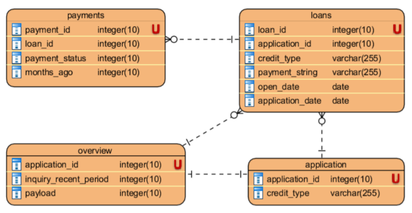
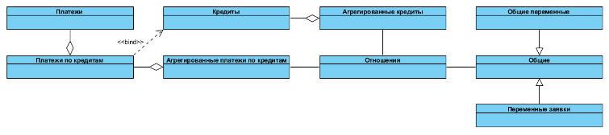
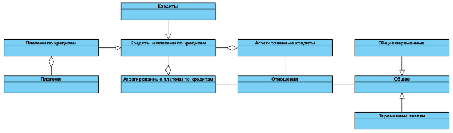

Логика и идея
=============
Происходит разбиение однотипного процесса агрегации переменных на фильтр и тело. Например, количество за последние 1, 2, 3 и так далее месяцев. Количество - тело. За 1, 2, 3 и так далее месяцев - фильтры.

Схема агрегации:



Логическая схема агрегации и формирующихся таблиц:



Реальная схема агрегации и формирующихся таблиц:



Сгененированные переменные будут иметь вид
* Переменныe платежей: name\_flt1\_flt2\_...\_fltn, пример: CNTp_PFD00_PFP02
    * name - имя переменной
    * flt - использованный фильтр платежей
* Переменные кредитов: name\_flt1\_flt2\_...\_fltn, пример: CNT_CFA03_CFT04
    * name - имя переменной
    * flt - использованный фильтр кредитов
* Переменные платежей по кредитам: name\_flt1\_flt2\_...\_fltn, пример: CNTp_PFD00_PFP02_sum_CFA03_CFT04
    * name - имя переменной, при этом название переменной платежа заменяется на всевозможные агрегированные комбинации
    * flt - использованный фильтр кредитов
* Общие переменные и переменные заявки: имя переменной из вкладки overview_vars, пример: inquiries_total
* Переменные отношений: numvar_TO_denvar_RATIO, пример: CNTp_PFP02_sum_CFT04_TO_CNT_CFT04_RATIO
    * numvar - полное название переменной числителя
    * denvar - полное название переменной знаменателя

##### Заметки:
* Для унификации фильтры всегда остортированы по алфавиту без учета регистра

Настроечный excel-файл
======================
Хранит всю информацию для формирования и описания признаков и для формирования SQL-скриптов.

Пример файла приведен в файле *usage_example/params_list.xlsx*

Содержание файла
----------------
### Вкладка global_flt 
Код глобальных фильтров, содержит следующие столбцы:
* __type__ - тип фильтра (может принимать значения Общий, Кредиты или Платежи)
* __cat__ - категория фильтра (три заглавных латинских буквы - первая G)
* __num__ - номер фильтра в категории (нумерация строго из двух символов, начиная с 00)
* __filter_id__ - объединение cat и num, уникальный ключ фильтра (реализуется в excel командой СЦЕПИТЬ(cat&num))
* __code__ - код фильтра для использования в WHERE (для num 00 код должен всегда возвращать значение TRUE)
* __include__ - включить / исключить фильтр (принимает значения 1 или 0)

### Вкладка flt 
Код фильтров переменных, содержит следующие столбцы:
* __type__ - тип фильтра (может принимать значения Кредиты или Платежи)
* __category__ - текстовое описание категории фильтра (как и cat избыточно дублируется)
* __label__ - текстовое описание значения конкретного фильтра
* __cat__ - категория фильтра (три заглавных или три прописных латинских буквы (категории различающиеся только регистром обозначают одно и то же, но в заглавном с более широким разбиением), для фильтров кредитов первая C или c, для фильтров платежей первая P или p)
* __num__ - номер фильтра в категории (нумерация строго из двух символов, начиная с 00)
* __filter_id__ - объединение cat и num, уникальный ключ фильтра (реализуется в excel командой СЦЕПИТЬ(cat&num))
* __code__ - SQL код фильтра, возвращающий TRUE или FALSE для использования вместо flt в коде переменной (для num 00 код должен всегда возвращать значение TRUE)
* __include__ - включить / исключить фильтр (принимает значения 1 или 0)

### Вкладка vars
Код для агрегации переменных с уровня платежей на уровень кредитов и с уровня кредитов на уровень заявки, содержит следующие столбцы:
* __label__ - текстовое описание переменной
* __name__ - имя переменной (состоит из латинских букв обоих регистров и символа подчеркивания, не заканчивается на _RATIO, для переменных типа Платежи по кредитам должны включать название образующей переменной типа Платежи)
* __type__ - тип переменной (уровень, с которого идет агрегация, может принимать значения Кредиты, Платежи по кредитам или Платежи)
* __funs__ - SQL код переменной (flt заменяется на код используемых фильтров, соединенных AND; для переменных типа Платежи по кредитам вместо имен переменных типа Платежи подставляются соответствующие переменные типа Платежи со всеми фильтрами)
* __comb__ - комбинации используемых фильтров (через + соединяются фильтры, которые будут использоваться совместно во всех комбинациях, не могут быть соединены фильтры, различающиеся только регистром, через ',' разъединяются комбинации кросс-объединенных фильтров, возможно как использование категории фильтра cat, так и конкретного filter_id)
* __include__ - включить / исключить переменную (принимает значения 1 или 0)

### Вкладка overview_vars
Код общих переменных и переменных заявки, содержит следующие столбцы:
* __label__ - текстовое описание переменной
* __name__ - имя переменной (состоит из латинских букв обоих регистров и символа подчеркивания, не заканчивается на «_RATIO»)
* __type__ - тип переменной (может принимать значения Общий или Заявка)
* __funs__ - SQL код переменной
* __include__ - включить / исключить переменную (принимает значения 1 или 0)

### Вкладка ratio_vars
Формируемые переменные отношений, содержит следующие столбцы:
* __num_name__ - имя переменной числителя (для неагрегированных переменных можно использовать «.*», как в регулярном выражении)
* __num_comb__ - комбинации фильтров числителя (для неагрегированных переменных - пустая строка, для агрегированных переменных список фильтров, соединенных через + и разъединенных через «,» (в одной строке разъединять фильтры не рекомендуется), соединенные фильтры должны быть использованы в алфавитном порядке, возможно как использование категории фильтра cat, так и конкретного filter_id (не рекомендуется использовать более одного «свободного» (по категории) фильтра), для номеров фильтров возможно использование [] для одной цифры, как в регулярном выражении)
* __den_name__ - имя переменной знаменателя (для неагрегированных переменных можно использовать «.*», как в регулярном выражении)
* __den_comb__ - комбинации фильтров знаменателя (для неагрегированных переменных - пустая строка, для агрегированных переменных список фильтров, соединенных через + и разъединенных через «,» (в одной строке разъединять фильтры не рекомендуется), соединенные фильтры должны быть использованы в алфавитном порядке, возможно как использование категории фильтра cat, так и конкретного filter_id (не рекомендуется использовать более одного «свободного» (по категории) фильтра), для номеров фильтров возможно использование [] для одной цифры, как в регулярном выражении)
* __include__ - включить / исключить переменную (принимает значения 1 или 0)

### Вкладка sources
Список источников данных (необходимо включить четыре источника), содержит следующие столбцы:
* __schema__ - схема таблицы в SQL
* __table__ - название таблицы в SQL
* __id__ - первичный ключ таблицы
* __group_by__ - внешний ключ, по которому таблица агрегируется на следующий уровень (для общей таблицы и таблицы заявок не нужен)
* __type__ - тип таблицы (Платежи, Кредиты, Общий или Заявка)
* __comb__ - комбинация глобальных фильтров для использования в WHERE (возможно соединение через +)
* __include__ - включить / исключить источник (принимает значения 1 или 0)

### Вкладка processes
Список процессов для формирования скриптов, содержит следующие столбцы:
* __process__ - название процесса
* __suffix__ - суффикс таблиц процесса (может быть пустым)
* __include__ - включить / исключить процесс (принимает значения 1 или 0)

FE
==
`class FE(file, tables_schema, tables_prefix='bki_', table_for_each_variable=True, include_list=None)`

Класс для работы с конструированием признаков

##### Параметры:
* __file__: str - название настроечного файла
* __tables_schema__: str, *default=''* - схема в SQL хранилище, в которую будут записываться созданные таблицы
* __tables_prefix__: str, *default='bki_'* - префикс названий созданных таблиц в SQL хранилище
* __table_for_each_variable__: bool, *default=True* - создавать ли отдельную таблицу для каждого названия переменной
    * _True_ - создаются отдельные таблицы для каждой строки вкладки *vars* с типом Платежи по кредитам или Кредиты, одна таблица для всех строк вкладки *overview_vars*, таблица для каждой комбинации типов num_var и den_var (все переменные из вкладки *overview_vars* принадлежат типу Overview) вкладки *ratio_vars* 
    * _False_ - создается четыре таблицы: loans_agg (переменные вкладки *vars* с типом Кредиты), payments_agg (переменные вкладки *vars* с типом Платежи по кредитам), overview (переменные вкладки *overview_vars*) и ratio (переменные вкладки *ratio_vars*)
* __include_list__: list or None, *default=None* - список переменных для включения (для переменных, отсутствующих в списке, не будет сформирован SQL-код, если None - код будет сформирован для всех переменных)

##### Примеры:
```python
>>> fe = FE(file='params_list.xlsx',
...         tables_schema='Modeling.dbo',
...         tables_prefix='bki_var_')
>>> fe.create_scripts(output_dir='FE_scripts',
...                   split_scripts=False,
...                   drop_table_before_creating=True,
...                   use_compression=True)
>>> # В директории FE_scripts появятся скрипты, их надо выполнить
>>> # В SQL сохраняется базовая таблица
>>> import pyodbc
>>> import urllib
>>> from sqlalchemy import create_engine
>>> con = 'Driver={SQL Server};Server=;uid=;pwd=;'
>>> ch = pyodbc.connect(con)
>>> quoted = urllib.parse.quote_plus(con)
>>> engine = create_engine('mssql+pyodbc:///?odbc_connect={}'.format(quoted))
>>> data = fe.read_data(ch=ch,
...                     base_schema_table='Modeling.dbo.bki_base',
...                     base_table_id = 'appl_id',
...                     process='appl',
...                     reducing_memory_func=MemoryReducer(float_min_type=32, int_min_type=8).reduce)
```

```python
>>> FE.feature_name('CNT_CFA01_CFT05')
'CNT'
>>> FE.feature_fltr('CNT_CFA01_CFT05')
['CFA01', 'CFT05']
```

```python
>>> fe = FE(file='params_list.xlsx')
>>> fe.feature_description('CNT_CFA01_CFT05')
'Количество. Фильтр А: значение 1. Фильтр Т: значение 5.'
>>> fe.features_description(['CNT_CFA01_CFT05', 'CNT_CFA02_CFT04'])
{'CNT_CFA01_CFT05': 'Количество. Фильтр А: значение 1. Фильтр Т: значение 5.',
'CNT_CFA02_CFT04': 'Количество. Фильтр А: значение 2. Фильтр Т: значение 4.'}
>>> fe.create_terms_of_reference(['CNT_CFA01_CFT05', 'CNT_CFA02_CFT04'])
           feature                                               description  PX  PY \
0  CNT_CFA01_CFT05   Количество. Фильтр А: значение 1. Фильтр Т: значение 5.
1  CNT_CFA02_CFT04   Количество. Фильтр А: значение 2. Фильтр Т: значение 4.  

              loan_flt1              loan_flt2                                    X Y var
0  CFA01=IIF(A=1, 1, 0)   CFT05=IIF(T=5, 1, 0)  SUM(IIF(CFA01=1 and CFT05=1, 1, 0))     X
1  CFA02=IIF(A=2, 1, 0)   CFT04=IIF(T=4, 1, 0)  SUM(IIF(CFA02=1 and CFT04=1, 1, 0))     X
```

Методы
------
### \_\_init__
`__init__(self, file, tables_schema='', tables_prefix='bki_', table_for_each_variable=True, include_list=None)`

Конструктор класса

### create_scripts
`create_scripts(self, output_dir='FE_scripts', split_scripts=False, drop_table_before_creating=True, use_compression=True)`

Метод для формирования SQL-скриптов конструирования переменных

##### Параметры:
* __output_dir__: str, *default='FE_scripts'* - название директории для сохранения сформированных скриптов
* __split_scripts__: {None, False, True}, *default=False* - разделять ли скрипты на файлы
    * _None_ - все скрипты в одном файле
    * _False_ - 4 скрипта: агрегация платежей на кредит, агрегация кредитов на заявку, формирование общих переменных, формирование переменных отношений
    * _True_ - отдельный скрипт для каждой переменной, агрегированной с уровня кредитов на уровень заявки, и формирования каждой переменной отношений
* __drop_table_before_creating__: bool, *default=True* - добавлять ли строчку с удалением таблицы
* __use_compression__: bool, *default=True* - добавлять ли строчку с сжатием таблицы (ALTER TABLE table REBUILD PARTITION = ALL WITH (DATA_COMPRESSION = PAGE))

##### Возвращает:
Ничего не возвращает, в указанной директории в директориях соответствующих процессов появляются SQL скрипты для формирования переменных

### read_data
`read_data(self, ch, base_schema_table, base_table_id, process, join_how='inner', reducing_memory_func=None)`

Метод для [считывания из SQL хранилища в pandas.DataFrame](https://pandas.pydata.org/pandas-docs/stable/reference/api/pandas.read_sql.html). Считывание происходит посредством последовательного [присоединения](https://pandas.pydata.org/pandas-docs/stable/reference/api/pandas.DataFrame.merge.html) таблиц с переменными к указанной базовой таблице, содержащей идентификаторы и все необходимые для построениия модели дополнительные данные (целевая и группировочные переменные, предсказания старой модели итп)

##### Параметры:
* __ch__: SQLAlchemy connectable (engine/connection) or database str URI or DBAPI2 connection (fallback mode) - канал для подключения к базе данных
* __base_schema_table__: str - название базовой таблицы вместе со схемой хранения
* __base_table_id__: str - название столбца идентификатора в базовой таблице
* __process__: str - название процесса, для которого считываются данные
* __join_how__: {'left', 'right', 'outer', 'inner'}, *default='inner'* - тип последовательного присоединения таблиц
* __reducing_memory_func__: callable or None, *default=None* - функция принимающая pandas.DataFrame и возвращающая его в сжатом виде, если None, то сжатия в процессе считывания данных не происодит

##### Возвращает:
* __data__: DataFrame - датасет, содержащий все поля базовой таблицы и переменные из соответствующих таблиц переменных

### feature_name
`feature_name(feature)`

Статичный метод, возвращающий имя переменной из ее полного названия

##### Параметры:
* __feature__: str - полное название переменной

##### Возвращает:
* __name__: str - имя переменной

### feature_fltr
`feature_fltr(feature)`

Статичный метод, возвращающий список фильтров переменной из ее полного названия

##### Параметры:
* __feature__: str - полное название переменной

##### Возвращает:
* __fltr__: list - список фильтров переменной

### feature_description
`feature_description(self, feature)`

Метод, возвращающий текстовое описание переменной по ее названию

##### Параметры:
* __feature__: str - полное название переменной

##### Возвращает:
* __description__: str - текстовое описание переменной

### features_description
`features_description(self, features, n_threads=1)`

Метод, возвращающий текстовое описание списка переменных по их названию

##### Параметры:
* __features__: list - список названий переменных
* __n_threads__: int, *default=1* - количество потоков для использования в pool_map

##### Возвращает:
* __descriptions__: dict - словарь, в ключе которого название переменной, а в значении ее текстовое описание

### create_terms_of_reference
`create_terms_of_reference(self, features)`

Метод, возвращающий техническое задание на внедрение переменных по их названию. Пример технического задания приведен в файле usage_example/tor.xlsx

##### Параметры:
* __features__: list - список названий переменных

##### Возвращает:
* __terms_of_reference__: DataFrame - датафрейм с разбитым на детали формированием описания переменных

В список столбцов *terms_of_reference* входят:
* __feature__ - название переменной
* __description__ - описание переменной, полученной с помощью метода *feature_description*
* n столбцов __pay_flti__ - для всех фильтров платежей (n = максимальное количество ненулевых фильтров платежей в одной переменной)
* __PX__ - код переменной платежа числителя (пусто, если числитель не является агрегированной переменной платежей по кредитам)
* __PY__ - код переменной платежа знаменателя (пусто, если знаменатель не является агрегированной переменной платежей по кредитам или если переменная не является отношением)
* k столбцов __loan_fltj__ - для всех фильтров кредитов (k = максимальное количество ненулевых фильтров кредитов в одной переменной)
* __X__ - код числителя
* __Y__ - код знаменателя (пусто, если переменная не является отношением)
* __var__ - код переменной (X / Y, если переменная является отношением, X в противоположном случае)
